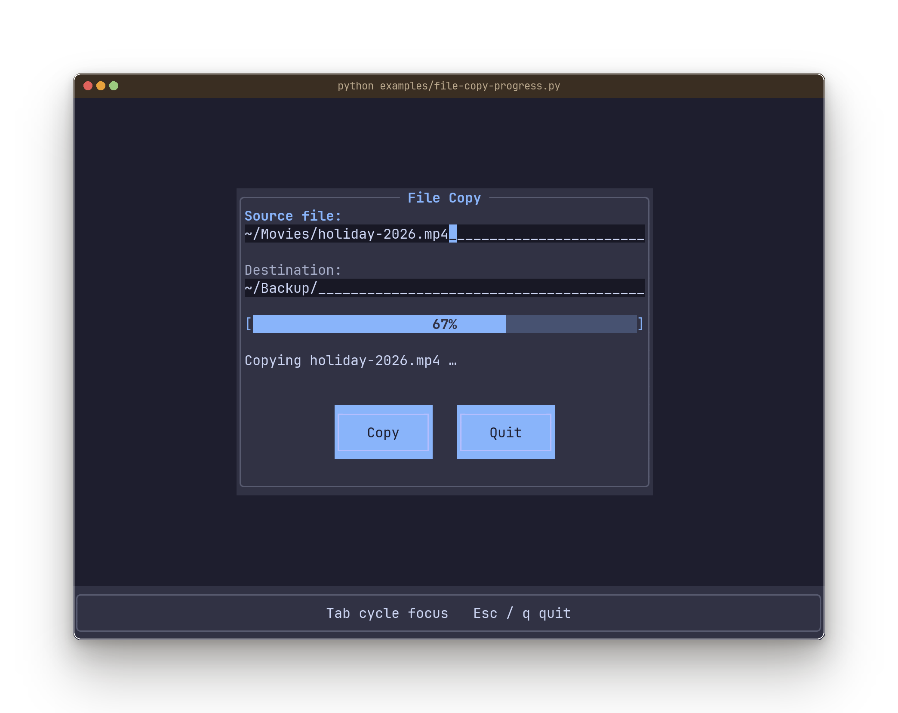
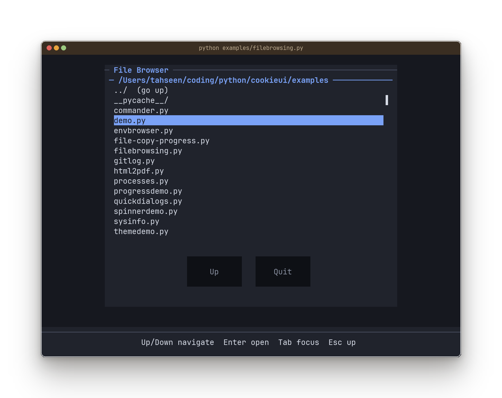
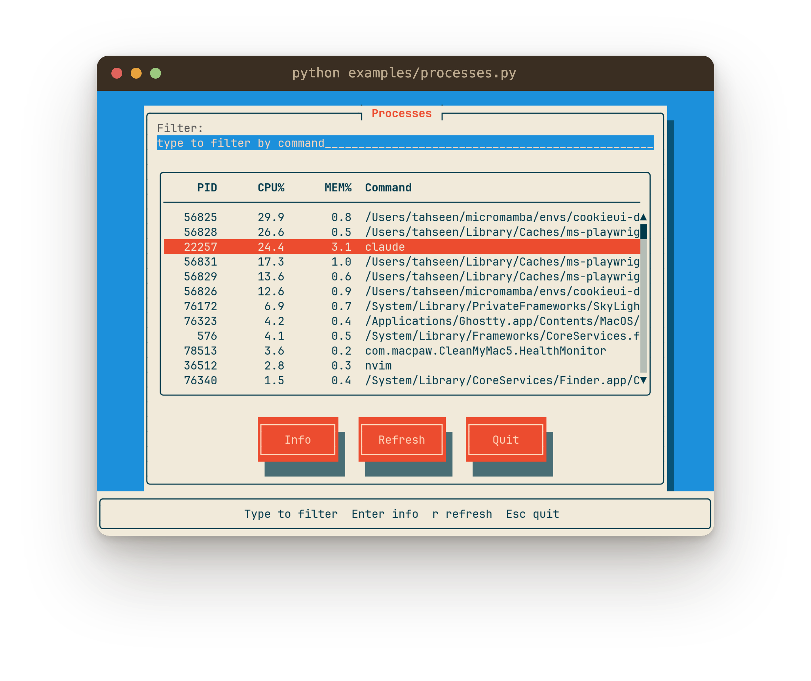
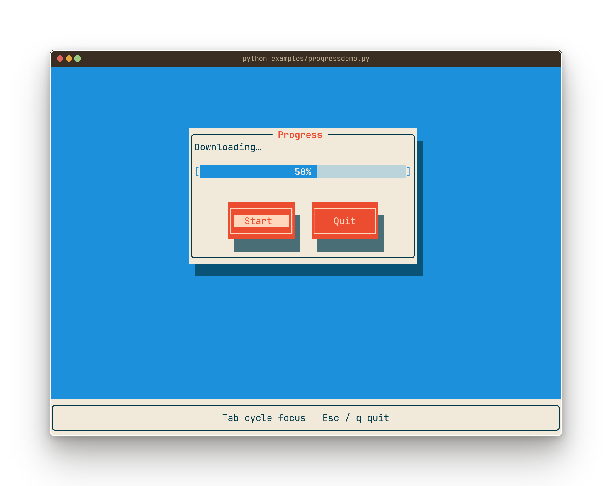
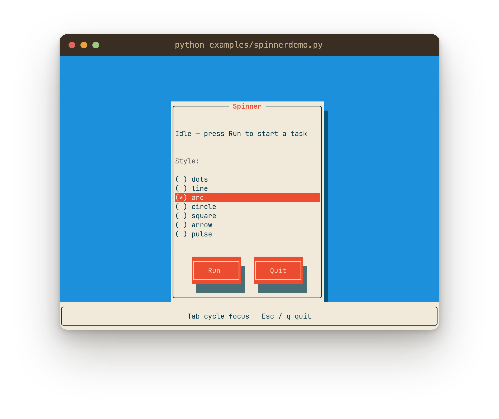
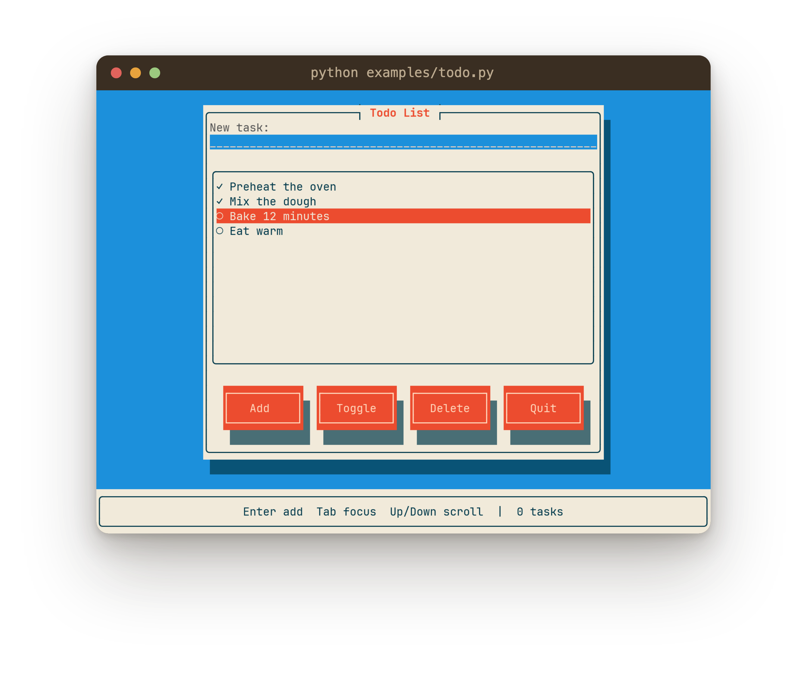
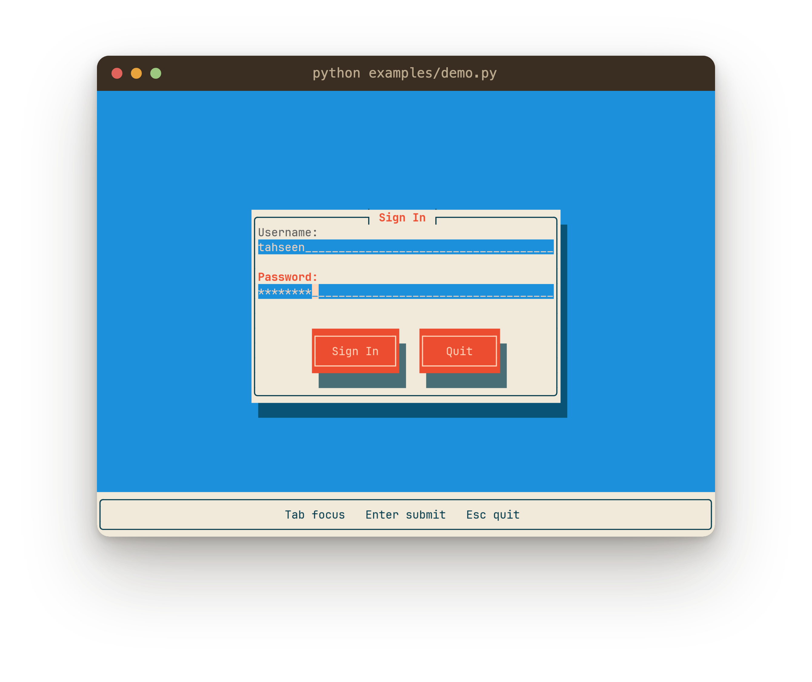
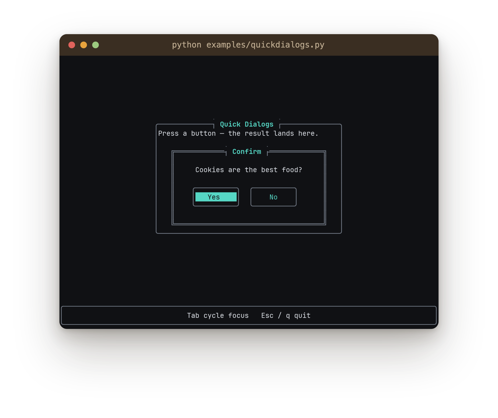
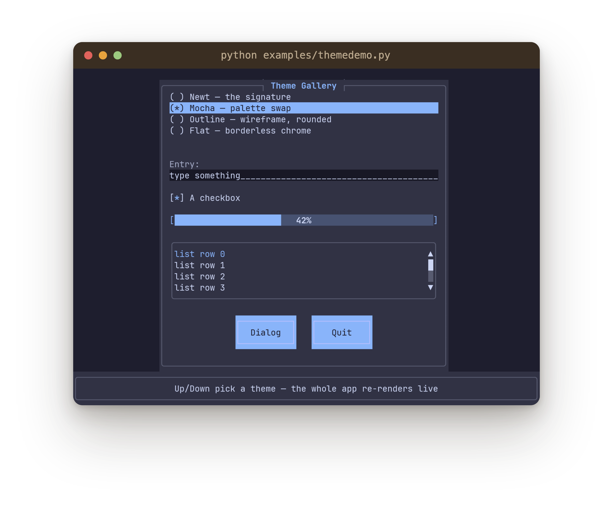
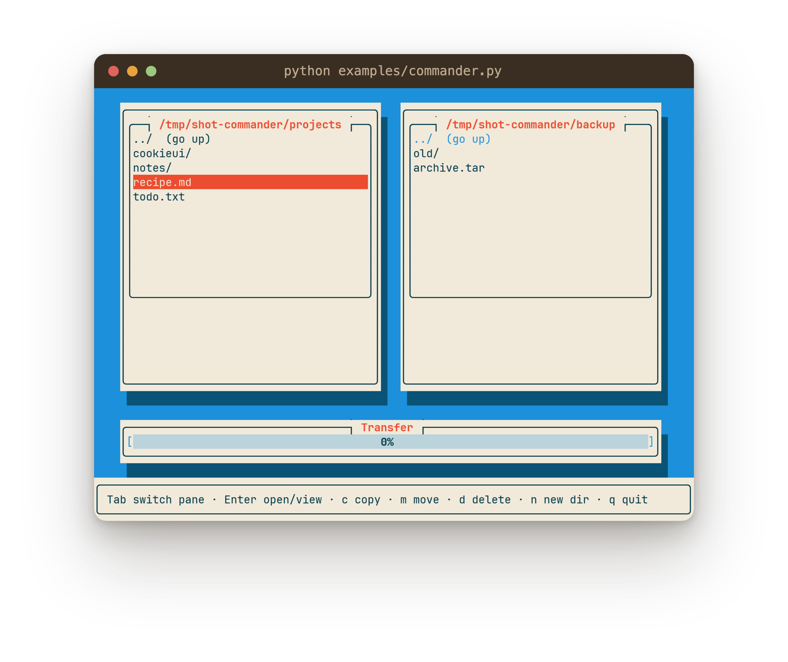

# CookieUI — A Zero-Dependency Python TUI Library

A lightweight, feature-rich terminal-UI library inspired by Newt: the original Newt color palette,
double-buffered 24-bit truecolor rendering, a widget/window architecture, and automatic layout helpers.
Build beautiful TUIs in pure Python with **zero runtime dependencies**.

## Prologue — the Newt lineage

CookieUI's look and feel descend directly from **[Newt](https://pagure.io/newt)** — the library behind
`whiptail` and the classic Red Hat/Debian text-mode installers. If you've ever installed Linux from a
console, you know the aesthetic: bordered windows floating on a bright blue background, drop shadows,
chunky buttons you Tab between, modal message boxes. That windowed dialog-box tradition — rather than
the web-style docked layouts of modern TUI frameworks — is the thought CookieUI started from.

**CookieUI is what Newt would look like if it were designed today**: the same classic look, rebuilt as
a pure-Python library with a modern interactive core.

| | Newt / whiptail / `snack` | CookieUI |
|---|---|---|
| Look | Windows + drop shadows on a blue background | The same — it's the signature |
| Colors | 16-color slang palette | 24-bit truecolor, themeable (`DEFAULT` Newt palette, `MOCHA`) |
| Rendering | slang, cell-based | Double-buffered **differential** ANSI — flicker-free, idle frames cost zero bytes |
| API | C, or the `snack` Python binding (form-centric, blocking) | `TuiApp` + `win.layout()` — callbacks, live attribute mutation |
| Interactivity | Static forms: run a form, collect results at the end | Continuous run loop: labels, spinners, and progress bars update live |
| App structure | One form at a time | View stack (`push_view`/`pop_view`), focus management, key bindings |
| Dependencies | libnewt + slang system packages | **Zero** — Python standard library only |

What CookieUI adds that Newt never had:

- **Live widgets** — `Spinner` and `ProgressBar` animate while your code works; set `label.text` or
  `progress.value` from anywhere and the next frame shows it. Newt forms are frozen while displayed.
- **Layout helpers instead of grid math** — `win.layout()`, `rows()`, `footer_buttons()`,
  shadow-aware stacking; no coordinate arithmetic, no `Grid` assembly.
- **An app framework, not just dialogs** — view navigation, auto-wired quit keys, a status bar,
  value-carrying listboxes, one-call background tasks (`run_task`), and automatic re-layout when
  the terminal is resized.
- **The whiptail quartet as one-liners** — `show_message()`, `confirm()`, `prompt()`, `choose()`:
  everything `whiptail` does, as auto-sizing, self-closing method calls.
- **Scrollable text** — `TextView` shows logs, file contents, and long command output with
  word-wrap and the classic Newt scrollbar.
- **Composable widgets** — `cookieui.contrib.FileBrowser` navigates directories in place; build your
  own by subclassing the primitives.
- **Truly zero install** — no C library, no system packages; copy the directory and run
  (or `pip install` it — the wheel has no dependencies either).

## Features

- **Zero dependencies** — pure Python, standard library only (`termios`, `tty`, `select`, `signal`)
- **Double-buffered differential rendering** — smooth, flicker-free ANSI 24-bit truecolor; only changed
  cells hit the wire, and an unchanged frame writes zero bytes (SSH- and battery-friendly)
- **Widget/window architecture** — composable containers and controls with real focus management
- **No eyeballed numbers** — sizes are fractions of the terminal or **content-fit** (the window wraps
  what you put in it); text clips at draw time; fill widgets compute their own height
- **Automatic layout** — `page()`, `columns()`, `rows()`, `win.layout()` remove positioning math
- **Automatic resize handling** — push views as builders and they rebuild + re-center when the terminal resizes
- **Batteries-included `TuiApp`** — auto-linked windows, auto Esc/q quit, an auto status bar, and one-line dialogs
- **One-line modal dialogs** — `show_message` / `confirm` / `prompt` / `choose`: auto-sized, self-closing
- **One-line background work** — `run_task(fn, status=…, running=…, done=…)`: worker thread, double-start
  guard, auto-detected progress bar/spinner, errors never silently lost
- **Scrollable text** — `TextView` for logs, file contents, and long output (word-wrap + Newt scrollbar)
- **A real design system, not just colors** — a theme carries the palette, every glyph
  (border sets, `[x]` brackets, `█░` progress pair), and a pluggable **chrome** that constructs
  every box. Four shipped looks: `NEWT` (the signature), `MOCHA` (dark), `OUTLINE`
  (wireframe — pure rounded line work, no filled panels), `FLAT` (borderless). Switch at
  runtime; design your own
  in minutes — see **TEMPLATING.md** and `examples/themedemo.py`

## Quick Start

```python
from cookieui import TuiApp

class HelloApp(TuiApp):
    def build_view(self):
        page = self.page(0.4, title='Hello')   # 40% of the terminal wide;
        page.label('Welcome to cookieui!')     # no height → wraps its content
        page.gap()
        page.buttons(['OK'])
        return page                            # Esc/q quit + status bar wired automatically

if __name__ == '__main__':
    HelloApp().run()
```

No `__init__`: `TuiApp` pushes `build_view` automatically (as a builder, so the view rebuilds on
terminal resize). A complete, styled, resizable app is the class above — eight lines.

That `0.4` is a *fraction of the terminal*, and the missing height means the window *wraps its
content* — never write eyeballed cell counts like `page(40, 18)`. The four ways to express a size
(fraction / content-fit / `rows=` / exact cells) are covered in **The sizing model** below — read
that section before writing your first real view.

## Installation

The library has zero runtime dependencies, so every install path is trivial:

- **Python:** 3.8+
- **Dependencies:** none (built-in `termios`, `tty`, `select`, `signal`)
- **Platform:** Linux, macOS, BSD — any POSIX terminal

Options:
1. **pip** — `pip install cookieui` (from PyPI; `pip install .` from the repo root, or
   `pip install -e .` for development), **or**
2. **conda / micromamba** — `micromamba install -c conda-forge cookieui` (available once
   the conda-forge feedstock is live; the recipe ships in `recipe/meta.yaml`), **or**
3. Copy the `cookieui/` package into your project (it's pure stdlib — copy-and-run), **or**
4. Add the repo root to `PYTHONPATH` (e.g. `export PYTHONPATH=/path/to/cookieui`).

License: **The Unlicense** (public domain). Use it for anything; the `LICENSE` file is
what makes that promise legible to package indexes and corporate license scanners.

### Running the examples

The example apps live in `examples/` and import the installed library — run
`pip install -e .` once from the repo root, then:

```bash
python examples/demo.py          # login → settings → dialogs showcase
python examples/quickdialogs.py  # the whiptail quartet: message/confirm/prompt/choose
python examples/todo.py          # task manager with JSON persistence
python examples/filebrowsing.py  # directory navigator + TextView file viewer
python examples/gitlog.py        # git commit viewer with scrollable commit details
python examples/sysinfo.py       # system dashboard (live in-place refresh)
python examples/envbrowser.py    # live-filtered environment variables
python examples/spinnerdemo.py   # animated spinner during a background task
python examples/progressdemo.py  # progress bar driven by a worker thread
python examples/file-copy-progress.py  # real chunked file copy with byte-accurate progress
python examples/processes.py     # live-filtered process table (Table widget), sorted by CPU
python examples/themedemo.py     # the design system: four looks, switched live
python examples/commander.py     # Cookie Commander: two-pane file manager (the capstone)
python examples/html2pdf.py      # HTML→PDF tool — needs extra deps: pip install playwright pillow
```

(`html2pdf.py` is the only example with extra dependencies; the rest are stdlib-only.)

## The standard app pattern

Subclass `TuiApp` and define `build_view()` — it's pushed automatically (as a builder, so the
view rebuilds on terminal resize). Initialize app state in `setup()`, which runs first:

```python
from cookieui import TuiApp

class TasksApp(TuiApp):
    def setup(self):
        self.tasks = []                       # keep state on the app, not in widgets —
                                              # it survives the rebuild on resize

    def build_view(self):
        page = self.page(0.6, 0.8, title='Tasks')  # fractions of the terminal —
        inp = page.input('New task')               # fixed height because the list fills it
        lb  = page.listbox()                       # no height: fills down to the footer
        lb.items = self.tasks

        def add():
            if inp.value.strip():
                self.tasks.append(inp.value.strip())
                lb.items = self.tasks              # mutate → redraws next tick
                inp.clear()

        page.footer([('Add', add), ('Quit', self.quit)])
        inp.on_enter = add
        return page                                # Esc/q quit wired automatically

if __name__ == '__main__':
    TasksApp().run()
```

## The sizing model — no eyeballed numbers

CookieUI's design rule: **every number in your app should be intent, never a guessed cell count.**
There are exactly four ways to express a size, and each says what you *mean*:

| You write | It means | Use when |
|---|---|---|
| `0.5` (float ≤ 1.0) | **A fraction of the terminal** — half the width/height, recomputed on every resize | "The window should take about this much of the screen" |
| *nothing* (no height) | **Content-fit** — the window wraps whatever the layout places in it | Forms, dialogs, button panels — anything with a known set of rows |
| `rows=5` | **A count of things** — show 5 visible rows in a listbox/textview | "I want the user to see 5 results at a time" |
| `54` (int) | **Exact cells** — you really mean 54 columns | Targeting a fixed terminal (e.g. an 80×24 console tool) |

And one *absence* of a number: a `page.listbox()` / `page.textview()` with no size at all **fills**
the space between the content above it and the footer buttons — computed from the same geometry
the footer row uses, so they can never drift apart.

The same principle — **anything the window already knows shouldn't be passed by the caller** —
gives single-widget windows a one-call body:

```python
win.fill_with(TextView, output, wrap=False)              # created, sized, added
browser = win.fill_with(FileBrowser, start_dir, on_select=open_file)
```

`fill_with(WidgetClass, *content_args, **kwargs)` supplies the position and size itself
(interior + fill height) and turns off the widget's drop shadow (it's already inside a window);
you pass only the *content* arguments.

### Content-fit windows

Omit the height and the window sizes itself to its content when the view is pushed:

```python
page = self.page(0.5, title='Sign In')    # width: half the terminal; height: wraps content
page.input('Username')
page.input('Password')
page.buttons([('Sign In', go), ('Quit', self.quit)])
return page                               # height finalized here — inputs + buttons + border
```

Add a field later and the window grows by itself; this is how Newt's own wrapped grids worked.

**Two rules follow logically** (the library enforces both with clear errors):

1. A content-fit window can't contain a *fill* widget — "fill the window" is circular when the window
   is "fit the content." Use `rows=N` instead: `page.listbox(rows=5)` works anywhere.
2. In a content-fit window, buttons flow with the content (`page.buttons(...)`) — `page.footer`
   pins to a bottom edge that doesn't exist yet. (`buttons_below` *is* allowed: it re-anchors itself
   once the height is known.)

**Which to choose:** content scrolls (listbox/textview fills the window) → fixed height, usually a
fraction: `page(0.7, 0.8)`. Content is a known set of rows (form, menu, dashboard) → content-fit:
`page(0.5)`.

### Side-by-side windows: `columns()`

```python
left, right = self.columns(view, 2, titles=['Preferences', 'Protocol'])   # equal split
main, side  = self.columns(view, [2, 1])                                  # 2:1 by weight
```

Widths are derived from the terminal (shadow-aware, centered as a block); heights default to
content-fit per window, so each column wraps its own content independently. No `(title, w, h)`
tuples, no coordinates.

Because fractions and content-fit are recomputed every time a builder view is rebuilt, **resizing
the terminal re-derives the entire layout** — proportions hold at any size.

## Widgets

All widgets take **screen-absolute** `x, y`. Constructor signatures:

- `Window(x, y, width, height, title='', icon='')` — bordered container with title, rounded corners,
  and a 1×1 drop shadow. `view.add(win)` auto-links it. Provides
  `interior() -> (x, y)`, `interior_size() -> (w, h)`, `interior_rect() -> (x, y, w, h)`,
  `fill_height(y, footer=True)` (height to fill the interior from row `y`, stopping above the
  footer-button row — no hand-counted rows), `fill_with(WidgetClass, *args, **kwargs)` (create a
  widget that fills the interior and add it — the caller passes only content arguments), and
  `layout(pad_x=1, pad_y=0, spacing=1)`.
- `Label(x, y, text, bold=False, dim=False, color=None, max_width=None)` — static text; set `lbl.text = '…'`
  to update live. `max_width` clips **at draw time**, so live updates can never overflow a border —
  no `text[:iw - 4]` slicing at call sites (labels from `page.label()` get it automatically).
- `Button(x, y, label, icon='', on_click=None, shadow=True)` — 3-line Newt button; `btn.on_click = fn` after construction too.
- `TextInput(x, y, width, label='', password=False, placeholder='', on_enter=None, on_change=None)` —
  entry field with blinking cursor. `inp.value` reads/sets text; `inp.set_value(s)` sets value +
  cursor-at-end; `inp.clear()` resets. `on_change(value)` fires after every **user edit** (typing,
  backspace, delete — never cursor moves or programmatic sets): the live-filter hook.
- `Checkbox(x, y, width, label, checked=False, on_change=fn(bool))` — `[*]`/`[ ]`, toggle with Space/Enter.
- `Listbox(x, y, width, height, items=None, title='', on_select=fn(idx, item), shadow=True)` — scrollable list
  with a Newt scrollbar. See **value-carrying items** below.
- `RadioGroup(x, y, width, options=None, selected=0, on_change=fn(idx))` — mutually-exclusive options.
- `Spinner(x, y, label='', frames=None, fps=12, color=None, style='dots')` — animated activity
  spinner; animates from the wall clock with no threads. Seven named styles — `dots`, `line`
  (pure ASCII), `arc`, `circle`, `square`, `arrow`, `pulse` — or any custom glyph cycle via
  `frames=` (single-cell-width characters only). `.visible = False` hides it, `.spinning = False`
  freezes it, `.frames = Spinner.STYLES['arc']` restyles it live.
- `ProgressBar(x, y, width, value=0.0, show_percent=True, color=None, text='')` — a self-contained
  status area: the **center** shows the live percent while progressing, and `.text` replaces it
  when set (the track spans the full width — no side suffix eating columns):
  `[██████ 42% ░░░░░░]` → `[█████Complete ✓████]`. Set `.value`/`.text` from anywhere; both are
  clipped/clamped at draw time. `run_task` targets the bar's text by default.
- `TextView(x, y, width, height, text='', title='', wrap=True, shadow=True)` — scrollable read-only
  multi-line text with the Newt scrollbar; for logs, file contents, help screens, command output.
  Set `.text` to replace content (tabs expand, long lines word-wrap; `wrap=False` clips instead);
  `scroll_to_end()` follows appended output. Keys: Up/Down, PgUp/PgDn, Home/End.
- `Table(x, y, width, height, columns=None, rows=None, title='', on_select=fn(idx, value), shadow=True)` —
  scrollable table: bold header, separator, selectable rows; keys identical to `Listbox`. Columns
  are specs — `'Name'`, `('Name', weight)`, `('CPU%', 1, '>')` for right-aligned numbers — and the
  widths are **derived** (interior split by weight, like `columns()`; ints in column specs are
  weights). Rows are value-carrying: `t.rows = [((pid, cpu, cmd), proc), …]`, read
  `t.selected_value`; cells are clipped per column at draw time, so pass them untrimmed. A row with
  the wrong cell count raises a teaching error. Sorting is data logic — sort, then assign `.rows`.
  `InputDialog` / `ChoiceDialog` add an entry field / a choice list. **Prefer the TuiApp one-liners**:
  `show_message(...)`, `confirm(...)`, `prompt(...)`, `choose(...)`.

### Composite widgets (`cookieui.contrib`)

Higher-level widgets built on the primitives — still zero external dependencies — re-exported from the
top-level `cookieui` package for convenience:

- `FileBrowser(x, y, width, height, start_dir, on_select=fn(Path), on_dir_change=fn(Path),
  extensions=None, show_hidden=False, dirs_only=False)` — a `Listbox` that navigates directories **in
  place**: entering a directory refreshes the listing, selecting a file calls `on_select(path)`. Shows the
  current directory as its title and carries each row's `Path` as the value. Also `.current_dir` and
  `.open_dir(path)`. (`extensions` is a set of lowercase suffixes like `{'.html', '.htm'}`.)

### Reading & writing widget state

The run loop redraws every tick — **mutate an attribute and it reflects next frame**; never call draw yourself.

| Widget | Read | Write / mutate |
|--------|------|----------------|
| `TextInput` | `inp.value` → `str` | `inp.set_value(s)`, `inp.clear()`, `on_enter=fn` |
| `Label` | `lbl.text` | `lbl.text = '…'` (live, no rebuild; clipped to `max_width` at draw) |
| `Checkbox` | `cb.checked` → `bool` | `cb.checked = True` |
| `RadioGroup` | `rg.selected` → label; `rg.selected_index`; `rg.selected_value` | `options=[…]` or `[(label, value), …]` |
| `Listbox` | `lb.selected` → label; `lb.selected_index`; `lb.selected_value` | `lb.items = […]` or `[(label, value), …]`; `lb.selected_index = 0` |
| `TextView` | `tv.text` → `str` | `tv.text = '…'` (re-wraps); `tv.scroll_to_end()` to follow output |
| `Table` | `t.selected` → cells; `t.selected_index`; `t.selected_value` → carried object | `t.rows = [((cells…), value), …]` — auto-clamps selection; `t.selected_index = 0` |
| `ProgressBar` | `pb.value` → `float` | `pb.value = 0.42` (clamped at draw); center shows the percent, `pb.text = '…'` replaces it |

### Value-carrying items (no parallel lists)

`Listbox` and `RadioGroup` accept `(label, value)` pairs — the label is shown, the value is recovered with
`selected_value`. This removes the error-prone "second array indexed by `selected_index`" pattern:

```python
lb.items = [(f.name, f) for f in paths]    # label shown, Path carried
picked = lb.selected_value                  # → the Path directly

radio.options = [('A4', a4_dict), ('A3', a3_dict)]
dims = radio.selected_value                  # → the dict
```

## Layout helpers

### `self.page()` — one object to talk to

Every standard view starts with `page()`, and the returned **Page delegates to its parts**, so
the whole view/window/layout vocabulary collapses into one name — layout factories
(`page.input/.label/.listbox/.buttons/…`), window helpers (`page.fill_with/.add/…`),
`page.footer([...])` for the footer row, and `return page` (push_view unwraps it):

```python
def build_view(self):
    page = self.page(0.5, title='Sign In')      # fraction wide, content-fit tall
    page = self.page(0.7, 0.8, title='Files')   # fixed height (for fill widgets)
    ...
    return page
```

Sizing follows **The sizing model** above (fractions / content-fit / cells); `pad_x`/`pad_y`/
`spacing` pass through to the layout. The parts stay reachable as `page.view` / `page.win` /
`page.lay` — key bindings and `status_bar` take `page.view` — and old-style unpacking
(`view, win, lay = self.page(...)`) still works.

### Stacking widgets — what `page.input()/.listbox()/…` is

Those page methods delegate to a `VerticalLayout` anchored at the window's interior, which
positions **and adds** each widget it builds:

```python
inp = page.input('Name')         # created, positioned, added
cb  = page.checkbox('Enable')
rg  = page.radio_group(OPTIONS)
prefs = page.checkboxes(['Notifications', ('Dark mode', True)])     # batch, returns a tuple
page.buttons([('Sign In', do_login), ('Quit', self.quit)])          # labels + callbacks together
ok, cancel = page.buttons(['OK', 'Cancel'])                         # plain labels still fine
```

Methods: `.label()` (clips to the layout width at draw time), `.checkbox()`, `.checkboxes(specs)`,
`.input(on_enter=)`, `.radio_group()`, `.listbox()` / `.textview()` (no size = **fill to the footer
buttons**; `rows=5` = show 5 rows — see The sizing model), `.spinner()`,
`.progressbar()`, `.buttons(specs)` (labels or
`(label, fn)` pairs; returns a tuple), `.gap(lines=1)`, `.fill_height(footer=True)`. Use
`page.lay.x / .y / .width` as an anchor when a row needs custom placement. Working with a raw
`Window` (no page)? `win.layout()` returns the same layout; a bare
`VerticalLayout(x, y, width, spacing=1, target=None)` only positions unless you pass `target=`.

### Button rows — `page.footer` / `buttons_below`

```python
page.footer([('Save', do_save), ('Quit', self.quit)])            # inside the window, at its footer
buttons_below(view, win, [('Save', do_save), ('Back', back)])    # floating below a window (shadow-aware)
```

Each spec is a `(label, on_click)` tuple; both return the buttons as a tuple.
(`page.footer` wraps `footer_buttons(win, …)` — use the latter with raw Windows.)

### `self.columns()` — side-by-side windows

Covered in detail under **The sizing model** above; the short version:

```python
left, right = self.columns(view, 2, titles=['Preferences', 'Protocol'])
left.layout().checkbox('Dark mode', checked=True)
right.layout().radio_group(PROTOCOLS)
```

Options: `spec` (count or weight list), `height` (default content-fit; fraction/cells/list),
`width` (the whole block, default 0.9 of the terminal), `gap`.

### `self.rows()` — stacked windows (the vertical mirror of `columns`)

```python
log, status = self.rows(view, [12, 3], titles=['Build log', 'Status'], width=0.8)
log.layout()      # furnish each returned window through its own cursor
status.layout()
```

`spec` is a window count (equal heights) or a list of per-window heights (ints = rows,
floats = fraction of the terminal); all share `width`, the stack is centered as a block,
each window's drop shadow + `gap` reserved between neighbours.

### Positioning primitives

```python
ix, iy, iw, ih = win.interior_rect()             # interior() + interior_size() in one call
h = win.fill_height(iy)                          # fill from row iy, stop above the footer row
lb = page.listbox()                              # or: the page's layout fills to the footer itself

# Shadow-aware stacking (a window at (x,y,w,h) occupies through row y+h / col x+w):
next_y = stack_below(y, height, gap=1)           # shadow-aware vertical stacking
next_x = stack_beside(x, width, gap=2)
```

Also available (low-level, used internally by the helpers above): `calculate_centered_window`,
`layout_buttons`, `calculate_footer_position`, `create_status_bar`, `resolve_size`, `SHADOW`.

## `TuiApp` base class

```python
class MyApp(TuiApp):
    AUTO_QUIT   = True                  # Esc/q quit every view (set False to manage keys yourself)
    AUTO_STATUS = True                  # add a default status bar if a view builds none
    AUTO_RESIZE = True                  # rebuild builder-pushed views when the terminal resizes
    AUTO_VIEW   = True                  # push build_view automatically (no __init__ needed)
    STATUS_HINT = 'Tab cycle focus   Esc / q quit'

    def setup(self): ...                # optional: app state, runs before build_view
    def build_view(self): ...           # pushed automatically as a builder
```

When the constructor takes arguments (a path, a repo), set state **before** `super().__init__()`
— `build_view` runs inside it:

```python
class GitLog(TuiApp):
    def __init__(self, repo=None):
        self.repo = repo or Path.cwd()  # state first — build_view needs it
        super().__init__()              # auto-pushes build_view (theme: super().__init__(MOCHA))
```

**Methods:**
- `def setup(self)` — override it: runs before `build_view` is auto-pushed; use instead of
  `__init__` when you need to initialize state (`self.tasks = load_tasks()`)
- `self.page(width=0.6, height=None, title='')` → a delegating `Page` object — the one-line view
  scaffold; fractions or cells, no height = content-fit (see The sizing model and `self.page()`)
- `self.columns(view, spec=2, titles=None, height=None, …)` → side-by-side Windows, widths derived
- `self.centered_window(w, h)` → `(x, y, w, h)`, clamped to the terminal
- `self.status_bar(view, text)` — a custom footer bar (suppresses the auto one)
- `self.show_message(title, message, buttons=['OK'], on_close=fn(label))` — auto-closing dialog
- `self.confirm(title, message, on_yes, yes='Yes', no='No', on_no=None)` — yes/no (Esc picks `no`)
- `self.prompt(title, message='', on_submit=fn(str), default='', placeholder='', password=False)` — text-entry dialog
- `self.choose(title, items, on_pick=fn(value), message='')` — pick-from-list dialog (`(label, value)` pairs work)
- `self.run_task(fn, *args, status=label, running='…', done='…', error='…', on_done=fn, on_error=fn)`
  — run a domain function on a worker thread: double-start guard, **auto-detected** progress
  bar/spinner, status text for running/done/error, error dialog fallback (see Background work)
- `self.push_view / pop_view / replace_view`, `self.quit()`
- `self.ts.width()`, `self.ts.height()` — terminal size; `self.KeyType` — for key handlers

**Auto-wiring:** on every `push_view`/`replace_view`, `TuiApp` binds Esc/q → `self.quit` (TextInput-aware,
so `q` types normally while editing) and adds a default status bar — both opt-out via the class attributes.
To make Esc mean something else — "go back" on one pushed view, or app-wide — see `bind_quit` under
**Key & event helpers** below: calling it on a view marks it quit-bound, so the auto-wiring skips it.

### Resize handling

`push_view`/`replace_view` accept either a built `View` or a **zero-arg builder**. Pass the builder and
the view re-runs it whenever the terminal is resized — fractions, content-fit, `columns()`, and `centered_window()`
read the new size, so everything re-centers with no extra code:

```python
# build_view is pushed this way automatically (AUTO_VIEW); for additional views:
self.push_view(self.build_detail)                     # rebuilt + re-centered on resize
self.replace_view(lambda: self.build_page(name))      # builders with args: capture, then lambda
self.push_view(self.build_detail())                   # plain view — fixed at build-time size
```

Two rules make rebuilds painless: **keep state on the app** (not in widgets), and remember that a
rebuild re-runs your `build_view` exactly like the first time. Set `AUTO_RESIZE = False` if a view
holds widget state you can't reconstruct.

### Dialogs — the whiptail quartet

CookieUI's Newt ancestry shows here: everything `whiptail` does is one method call. Dialogs
**close themselves** on any button or Escape; the callback just says what to do after:

```python
self.show_message('File Info', text)                       # msgbox    — plain OK
self.confirm('Quit?', 'Are you sure?', self.quit)          # yesno     — Esc = No
self.prompt('Name', 'Who is asking?', on_submit=greet)     # inputbox  — Enter submits
self.choose('Branch', branches, on_pick=checkout)          # menu      — Enter picks
```

`prompt` supports `default=`, `placeholder=`, and `password=True`; `choose` takes plain labels or
`(label, value)` pairs and hands `on_pick` the paired value. Cancelling (Escape or the Cancel button)
runs the optional `on_cancel` instead.

Dialogs auto-size to their content but **never balloon**: long message lines are word-wrapped at
`max_width` (default `0.6` — a fraction of the screen, sizing-model semantics; pass cells or another
fraction to tune) — so a 300-character exception string becomes a tidy multi-line dialog, not a
screen-wide one.

### Background work: `run_task`

Long work runs on a worker thread; `run_task` does the entire ceremony — single-flight guard,
progress/spinner wiring, status text, error surfacing, thread spawn — usually in **one line**:

```python
def start(self):
    self.run_task(copy_file, src, dst, status=self.status,
                  running=f'Copying {src.name} …',
                  on_done=lambda n: f'✓ {n:,} bytes',
                  on_error=lambda e: f'✗ {e}')
```

- **Progress and spinner are found automatically**: a view with exactly one `ProgressBar` gets
  it reset, wired to the engine's `on_progress`, and filled to 1.0 on success; exactly one
  `Spinner` is shown for the duration. Pass `progress=`/`spinner=` to target explicitly, or
  `None` to disable. (The bar can stay a *local* in `build_view` — nothing else references it.)
- **The bar is its own status area**: while progressing its center shows the live percent; with
  no `status=` widget the running/done/error texts take that center, installer-style —
  `run_task(download, done='Complete ✓')` is a complete progress UI with no label at all:
  `[██████ 42% ░░░░░░]` while running, `[█████Complete ✓████]` at the end. Pass `status=label`
  to route text elsewhere.
- **Outcome parameters follow the library-wide naming rule** (the same as `confirm`'s
  `yes='Yes'` / `on_yes=fn`): **a bare noun is a value, an `on_`-noun is a callable.**
  `done='Saved ✓'` for static success text — never write a lambda for a constant;
  `on_done=lambda n: f'✓ {n:,} bytes'` when the text needs the result (its returned string is
  shown when `done=` is absent; return `None` to handle display yourself; both together work —
  `on_done` for behavior, `done=` for the text). With neither, `str(result)` is shown — an
  engine that returns its message needs zero wiring. `error='✗ failed'` / `on_error=fn(exc)`
  mirror it; with neither, status shows `Error: …` (or an Error dialog when there's no
  status) — failures are never silently lost.
- `running='…'` appears only if the task actually starts (the guard returns `False` otherwise).

Write the engine as a **pure domain function** — `copy_file(src, dst, on_progress)` returns its
result, raises on failure, reports through the callback, and never knows widgets or threads
exist. See `examples/file-copy-progress.py` and PATTERNS.md's "domain/UI boundary rule".

## Key & event helpers

```python
from cookieui import bind_key, bind_enter_action, chain_key_handler

bind_key(view, KeyType.ESCAPE, go_up)              # run fn() on a key (chaining handled internally)
bind_key(view, KeyType.CHAR, refresh, char='r')    # specific char key
bind_enter_action(listbox, on_pick)                # Enter on a widget
TextInput(..., on_enter=submit)                    # Enter on an input — no binding needed
inp.on_change = refresh                            # fires with the new text per edit — live filter
chain_key_handler(widget, fn(key) -> bool)         # low-level escape hatch (return True = consume)
```

**Form flow is automatic:** Enter in a `TextInput` with no `on_enter` moves focus to the next widget
(same order as Tab) — chain fields with zero wiring and set `on_enter` only on the last one (submit).

For app-wide quit you usually write nothing — `TuiApp.AUTO_QUIT` handles it. Use `bind_quit(view, on_quit)`
for custom behaviour: it marks the view as quit-bound, so even with `AUTO_QUIT = True` a pushed view can make
Esc/q mean "go back" (`bind_quit(view, self.pop_view)`) while every other view keeps the automatic quit.

## Examples

Twelve runnable apps in `examples/`. Each documents its patterns in a `DESIGN PATTERNS
DEMONSTRATED` docstring section, and **[`PATTERNS.md`](PATTERNS.md)** is the
cheat sheet mapping every pattern to the file that demonstrates it best — start there.

| App | Demonstrates |
|-----|--------------|
| `demo.py` | Multi-screen login → settings → dialogs; content-fit `page(0.5)`, `columns()`, `confirm`, builder views |
| `quickdialogs.py` | The whiptail quartet — `show_message` / `confirm` / `prompt` / `choose`, one line each |
| `todo.py` | Task manager; `setup()` state, fill `page.listbox()`, `page.footer`, JSON persistence |
| `filebrowsing.py` | `FileBrowser` contrib widget + `TextView` file viewer; push/pop drill-down, Esc=up |
| `gitlog.py` | Git commit viewer; full `git show` output in a scrollable `TextView`, value-carrying listbox |
| `sysinfo.py` | System dashboard; **in-place `label.text` refresh** (no view rebuild), `bind_key` 'r' |
| `envbrowser.py` | Live-filtered env vars; `inp.on_change`, value-carrying listbox |
| `spinnerdemo.py` | One-line `run_task(long_task, status=…, running=…)` — auto-detected `Spinner`, result becomes the status |
| `themedemo.py` | The design system live: one app in all four looks (NEWT/MOCHA/OUTLINE/FLAT), switched from a radio group |
| `commander.py` | **Cookie Commander** — two-pane file manager: FileBrowser panes, copy/move/delete with byte-accurate progress, viewer, confirmations (the book's capstone) |
| `progressdemo.py` | One-line `run_task(download, done='Complete ✓')` — auto-detected `ProgressBar`, no lambdas |
| `file-copy-progress.py` | `run_task` on **real I/O**: pure `copy_file` engine, byte-accurate progress, atomic publish, error text |
| `processes.py` | `Table` with weighted/right-aligned columns; live filter (`on_change`), value-carrying rows, `r` refresh |
| `html2pdf.py` | HTML→PDF tool built on the **lower-level `App`/`View`** API (needs `playwright`, `pillow`) |

## Screenshots

Rendered from real composed frames by `screenshots/generate.py` — re-run it after
any visual change and the screenshots cannot go stale.

| | |
|---|---|
| File copy, mid-transfer — Mocha (`file-copy-progress.py`) | File browser — Flat (`filebrowsing.py`) |
|  |  |
| Process table (`processes.py`) | Progress bar (`progressdemo.py`) |
|  |  |
| Spinner styles (`spinnerdemo.py`) | Todo (`todo.py`) |
|  |  |
| Login (`demo.py`) | Dialogs — Outline (`quickdialogs.py`) |
|  |  |
| Theme gallery, switched live (`themedemo.py`) | Cookie Commander (`commander.py`) |
|  |  |

## Architecture

```
cookieui/
├── __init__.py     public API (everything importable from `cookieui`)
├── app.py          App + View (run loop, view stack, focus, dialog overlay)
├── theme.py        Theme, MOCHA, DEFAULT
├── helpers.py      TuiApp + layout/key helpers
├── core/           terminal.py, screen.py, event.py (Key/KeyType)
├── widgets/        window, dialog (+ input/choice dialogs), button, label, textinput,
│                   checkbox, listbox, radiogroup, spinner, progressbar, textview, base
└── contrib/        composite widgets built on the primitives (FileBrowser)
```

- **Rendering:** a double-buffered cell grid (char, fg, bg, bold, italic, dim) flushed as batched 24-bit
  ANSI — **differentially**: the previous frame is kept and only changed cells are emitted (as per-row
  spans with cursor jumps), so an unchanged frame writes zero bytes and a ticking label costs ~50 bytes,
  not the ~14 KB a full 200×50 repaint costs. First frame and every resize repaint fully. Shadows tint
  the background ~70% toward dark blue-gray and text to ~15% brightness.
- **Coordinates:** screen-absolute from `(0, 0)`. A window's borders take 1 cell on each side and its shadow
  extends 1 column right / 1 row down — `interior()`/`interior_rect()`/`win.layout()` account for all of it.
- **Focus:** `View` keeps a flat focusable list (global Tab/Shift-Tab); a `Window` handles arrow-key
  navigation between its children; `View` syncs focus to the actually-focused widget each key event.
- **Run loop:** single-threaded, polls `read_key(timeout=0.05)` (~20 FPS) and redraws every tick;
  `quit()` / Ctrl-C tear down the terminal cleanly.
- **Resize:** `SIGWINCH` only records the new size; the run loop applies it between frames (never
  mid-render), then `TuiApp` re-runs the builder of every builder-pushed view (`AUTO_RESIZE`).

## Keyboard controls

| Key | Action |
|-----|--------|
| **Tab / Shift-Tab** | Focus next / previous widget (global cycle) |
| **Arrows** | Navigate within the focused window, move the TextInput cursor, scroll a TextView |
| **PgUp / PgDn** | Page through a Listbox or TextView |
| **Home / End** | Start / end of a TextInput, RadioGroup, Listbox, or TextView |
| **Space** | Toggle Checkbox, cycle RadioGroup |
| **Enter** | Activate Button, submit TextInput (`on_enter`) or move to the next field (no `on_enter`), select Listbox item, submit a `prompt` |
| **Backspace / Delete** | Edit in TextInput |
| **Esc / q** | Quit (automatic via `TuiApp.AUTO_QUIT`; `q` still types inside a focused TextInput) |

## Themes

Two themes ship: **NEWT** (default, original colors) and **MOCHA** (Catppuccin palette).

```python
from cookieui import TuiApp, MOCHA

class MyApp(TuiApp):
    def __init__(self):
        super().__init__(theme=MOCHA)
```

Newt palette:

```
Background        RGB(28, 144, 219)    bright saturated blue
Window surface    RGB(241, 234, 218)   warm beige
Button background RGB(236, 76, 47)     coral-red
Button text       RGB(255, 215, 188)   warm peachy-white
Text / borders    RGB(0, 0, 0)         black
Shadows           RGB(1, 57, 75)       dark blue-gray
```

## Terminal requirements

24-bit truecolor (most modern terminals), POSIX `termios` (Linux/macOS/BSD), 80×24 minimum recommended.

## License

Public domain — use freely in any project.
